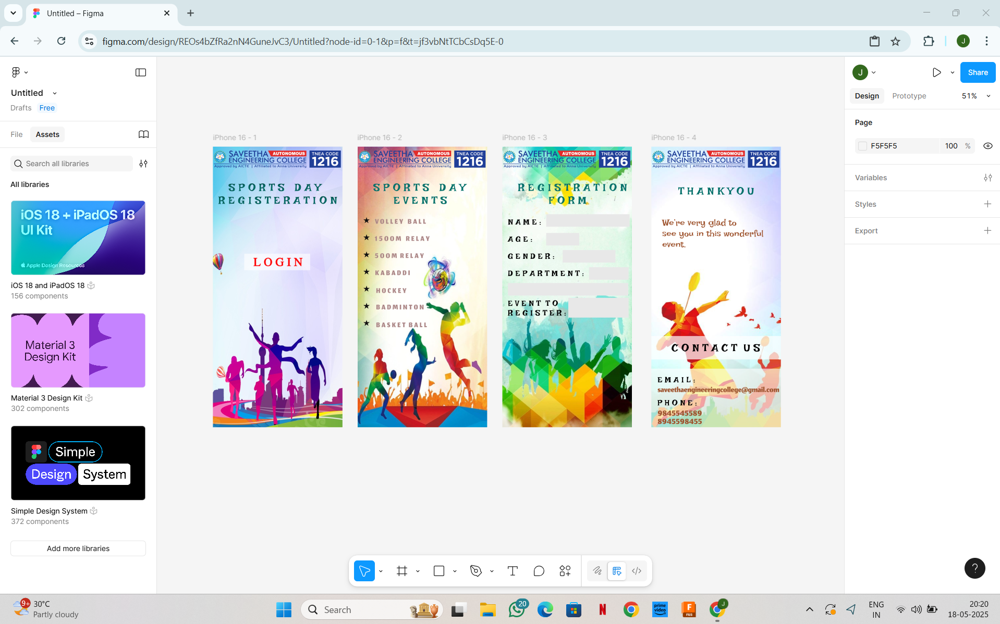

# Ex09 Event Registration Web Application
## Date: 18.05.25

## AIM:
To design, develop and deploy a web application for event registration.

## DESIGN STEPS:

### Step 1: 
Create a new frame.

### Step 2:
Select any one preset size of your choice.

### Step 3:
Select the shapes you need.

### Step 4:
Import images as needed.

### Step 5:
Create pages based on your need and link them.

### Step 6:

Validate the HTML and CSS code.

### Step 6:

Publish the website in the given URL.

## DESIGN TOOL:
Figma

## CODE:

```
Home Page

<!DOCTYPE html>
<html lang="en">
<head>
  <meta charset="UTF-8" />
  <meta name="viewport" content="width=device-width, initial-scale=1.0"/>
  <title>Sports Day Login</title>
  <link rel="stylesheet" href="styles.css" />
</head>
<body>
  <div class="screen login-screen">
    <div class="header">
      
      <div class="college-text">
        <h3>SAVEETHA ENGINEERING COLLEGE</h3>
        <p>Approved by AICTE | Affiliated to Anna University</p>
      </div>
      <div class="tnea-code">TNEA CODE <strong>1216</strong></div>
    </div>

    <div class="title">
      <h2>SPORTS DAY REGISTRATION</h2>
    </div>

    <div class="login-button">
      <a href="#" class="login-link">LOGIN</a>
    </div>

    <div class="background-illustration"></div>
  </div>
</body>
</html>

body {
  margin: 0;
  padding: 0;
  font-family: 'Segoe UI', sans-serif;
  background-color: #f0f0f0;
}

.screen.login-screen {
  width: 100%;
  max-width: 430px;
  margin: 0 auto;
  height: 100vh;
  background: linear-gradient(to bottom, #b3e5fc, #ffffff);
  position: relative;
  overflow: hidden;
  text-align: center;
}

.header {
  background: #003366;
  color: white;
  padding: 10px 15px;
  display: flex;
  flex-direction: column;
  align-items: center;
}

.header .college-logo {
  max-height: 50px;
  margin-bottom: 5px;
}

.header .college-text h3 {
  margin: 5px 0;
  font-size: 16px;
}

.header .college-text p {
  margin: 0;
  font-size: 12px;
  opacity: 0.85;
}

.tnea-code {
  margin-top: 5px;
  font-size: 12px;
  background: #0d47a1;
  padding: 3px 8px;
  border-radius: 4px;
  font-weight: bold;
}

.title h2 {
  font-size: 22px;
  margin: 25px 10px;
  color: #004d40;
  letter-spacing: 1.5px;
}

.login-button {
  margin: 20px auto;
}

.login-link {
  display: inline-block;
  padding: 10px 25px;
  background-color: white;
  color: red;
  font-weight: bold;
  text-decoration: none;
  font-size: 20px;
  border: 2px solid red;
  border-radius: 6px;
}

.background-illustration {
  position: absolute;
  bottom: 0;
  width: 100%;
  height: 55%;
  background-image: url('your-silhouette-image.png');
  background-repeat: no-repeat;
  background-size: cover;
  background-position: bottom center;
  z-index: -1;
}

Page 2

<!DOCTYPE html>
<html lang="en">
<head>
  <meta charset="UTF-8" />
  <meta name="viewport" content="width=device-width, initial-scale=1.0"/>
  <title>Sports Day Events</title>
  <link rel="stylesheet" href="styles.css" />
</head>
<body>
  <div class="screen events-screen">
    <div class="header">
      
      <div class="college-text">
        <h3>SAVEETHA ENGINEERING COLLEGE</h3>
        <p>Approved by AICTE | Affiliated to Anna University</p>
      </div>
      <div class="tnea-code">TNEA CODE <strong>1216</strong></div>
    </div>

    <div class="title">
      <h2>SPORTS DAY<br>EVENTS</h2>
    </div>

    <ul class="event-list">
      <li>★ VOLLEY BALL</li>
      <li>★ 1500M RELAY</li>
      <li>★ 500M RELAY</li>
      <li>★ KABADDI</li>
      <li>★ HOCKEY</li>
      <li>★ BADMINTON</li>
      <li>★ BASKET BALL</li>
    </ul>

    <div class="background-illustration events-bg"></div>
  </div>
</body>
</html>

body {
  margin: 0;
  padding: 0;
  font-family: 'Segoe UI', sans-serif;
  background-color: #f0f0f0;
}

.screen.events-screen {
  width: 100%;
  max-width: 430px;
  margin: 0 auto;
  height: 100vh;
  position: relative;
  overflow: hidden;
  background: linear-gradient(to bottom right, #ffe082, #ffffff);
  text-align: center;
  padding-bottom: 30px;
}

.header {
  background: #003366;
  color: white;
  padding: 10px 15px;
  display: flex;
  flex-direction: column;
  align-items: center;
}

.college-logo {
  max-height: 50px;
  margin-bottom: 5px;
}

.college-text h3 {
  margin: 5px 0;
  font-size: 16px;
}

.college-text p {
  margin: 0;
  font-size: 12px;
  opacity: 0.85;
}

.tnea-code {
  margin-top: 5px;
  font-size: 12px;
  background: #0d47a1;
  padding: 3px 8px;
  border-radius: 4px;
  font-weight: bold;
}

.title h2 {
  font-size: 22px;
  margin: 20px 10px;
  color: #004d40;
  letter-spacing: 1.5px;
}

.event-list {
  list-style: none;
  padding: 0;
  margin: 10px auto;
  font-size: 18px;
  color: #3e2723;
  font-weight: bold;
  text-align: left;
  width: 70%;
}

.event-list li {
  margin-bottom: 12px;
  letter-spacing: 1px;
}

.background-illustration.events-bg {
  position: absolute;
  bottom: 0;
  width: 100%;
  height: 55%;
  background-image: url('your-events-background.png');
  background-repeat: no-repeat;
  background-size: cover;
  background-position: bottom center;
  z-index: -1;
}

Page 3

<!DOCTYPE html>
<html lang="en">
<head>
  <meta charset="UTF-8" />
  <meta name="viewport" content="width=device-width, initial-scale=1.0"/>
  <title>Registration Form</title>
  <link rel="stylesheet" href="styles.css" />
</head>
<body>
  <div class="screen registration-screen">
    <div class="header">
      
      <div class="college-text">
        <h3>SAVEETHA ENGINEERING COLLEGE</h3>
        <p>Approved by AICTE | Affiliated to Anna University</p>
      </div>
      <div class="tnea-code">TNEA CODE <strong>1216</strong></div>
    </div>

    <div class="title">
      <h2>REGISTRATION<br><span class="highlight">FORM</span></h2>
    </div>

    <form class="form">
      <label for="name">NAME:</label>
      <input type="text" id="name" name="name" required />

      <label for="age">AGE:</label>
      <input type="number" id="age" name="age" required />

      <label for="gender">GENDER:</label>
      <input type="text" id="gender" name="gender" required />

      <label for="department">DEPARTMENT:</label>
      <input type="text" id="department" name="department" required />

      <label for="event">EVENT TO REGISTER:</label>
      <input type="text" id="event" name="event" required />
    </form>

    <div class="background-illustration registration-bg"></div>
  </div>
</body>
</html>

body {
  margin: 0;
  padding: 0;
  font-family: 'Segoe UI', sans-serif;
  background-color: #f0f0f0;
}

.screen.registration-screen {
  width: 100%;
  max-width: 430px;
  margin: 0 auto;
  height: 100vh;
  position: relative;
  overflow: hidden;
  background: linear-gradient(to bottom, #e0f7fa, #ffffff);
  text-align: center;
  padding-bottom: 30px;
}

.header {
  background: #003366;
  color: white;
  padding: 10px 15px;
  display: flex;
  flex-direction: column;
  align-items: center;
}

.college-logo {
  max-height: 50px;
  margin-bottom: 5px;
}

.college-text h3 {
  margin: 5px 0;
  font-size: 16px;
}

.college-text p {
  margin: 0;
  font-size: 12px;
  opacity: 0.85;
}

.tnea-code {
  margin-top: 5px;
  font-size: 12px;
  background: #0d47a1;
  padding: 3px 8px;
  border-radius: 4px;
  font-weight: bold;
}

.title h2 {
  font-size: 22px;
  margin: 20px 10px;
  color: #004d40;
  letter-spacing: 1.5px;
}

.title .highlight {
  color: #fbc02d;
}

.form {
  width: 80%;
  margin: 0 auto;
  text-align: left;
}

.form label {
  display: block;
  font-weight: bold;
  margin-top: 12px;
  font-size: 14px;
  color: #212121;
  letter-spacing: 1px;
}

.form input {
  width: 100%;
  padding: 8px;
  margin-top: 5px;
  border: 1px solid #ccc;
  border-radius: 6px;
  font-size: 14px;
}

.background-illustration.registration-bg {
  position: absolute;
  bottom: 0;
  width: 100%;
  height: 40%;
  background-image: url('your-registration-background.png');
  background-repeat: no-repeat;
  background-size: cover;
  background-position: bottom center;
  z-index: -1;
}

Page 4

<!DOCTYPE html>
<html lang="en">
<head>
  <meta charset="UTF-8" />
  <meta name="viewport" content="width=device-width, initial-scale=1.0"/>
  <title>Thank You</title>
  <link rel="stylesheet" href="thankyou.css" />
</head>
<body>
  <div class="screen thankyou-screen">
    <div class="header">
      
      <div class="college-text">
        <h3>SAVEETHA ENGINEERING COLLEGE</h3>
        <p>Approved by AICTE | Affiliated to Anna University</p>
      </div>
      <div class="tnea-code">TNEA CODE <strong>1216</strong></div>
    </div>

    <div class="thankyou-section">
      <h2>THANK YOU</h2>
      <p class="message">We’re very glad to see you in this wonderful event.</p>
    </div>

    <div class="contact-section">
      <h3>CONTACT US</h3>
      <p><strong>EMAIL:</strong><br><span class="email">saveethaengineeringcollege@gmail.com</span></p>
      <p><strong>PHONE:</strong><br>
        <span class="phone">9845545589</span><br>
        <span class="phone">8945598455</span>
      </p>
    </div>

    <div class="background-image"></div>
  </div>
</body>
</html>

body {
  margin: 0;
  padding: 0;
  font-family: 'Segoe UI', sans-serif;
  background-color: #ffffff;
}

.thankyou-screen {
  width: 100%;
  max-width: 430px;
  margin: 0 auto;
  height: 100vh;
  position: relative;
  background: linear-gradient(to bottom, #d7effb, #ffffff);
  overflow: hidden;
  text-align: center;
}

.header {
  background: #003366;
  color: white;
  padding: 10px 15px;
  display: flex;
  flex-direction: column;
  align-items: center;
}

.college-logo {
  max-height: 50px;
  margin-bottom: 5px;
}

.college-text h3 {
  margin: 5px 0;
  font-size: 16px;
}

.college-text p {
  margin: 0;
  font-size: 12px;
  opacity: 0.85;
}

.tnea-code {
  margin-top: 5px;
  font-size: 12px;
  background: #0d47a1;
  padding: 3px 8px;
  border-radius: 4px;
  font-weight: bold;
}

.thankyou-section h2 {
  color: #00796b;
  font-size: 22px;
  margin-top: 20px;
  letter-spacing: 2px;
}

.thankyou-section .message {
  color: #6b3e21;
  font-size: 16px;
  margin: 15px 20px;
  font-family: 'Courier New', cursive;
}

.contact-section {
  margin-top: 25px;
}

.contact-section h3 {
  font-size: 18px;
  font-weight: bold;
  letter-spacing: 1px;
  color: #000;
  text-transform: uppercase;
}

.contact-section p {
  font-size: 14px;
  color: #333;
  margin: 10px;
}

.email {
  color: #8b3e1f;
  font-weight: bold;
}

.phone {
  color: #00897b;
  font-weight: bold;
}

.background-image {
  position: absolute;
  bottom: 0;
  width: 100%;
  height: 40%;
  background-image: url('your-thankyou-background.png');
  background-repeat: no-repeat;
  background-size: cover;
  background-position: bottom center;
  z-index: -1;
}

```

## OUTPUT:


## RESULT:
The program to design, develop and deploy a web application for event registration is completed successfully.
